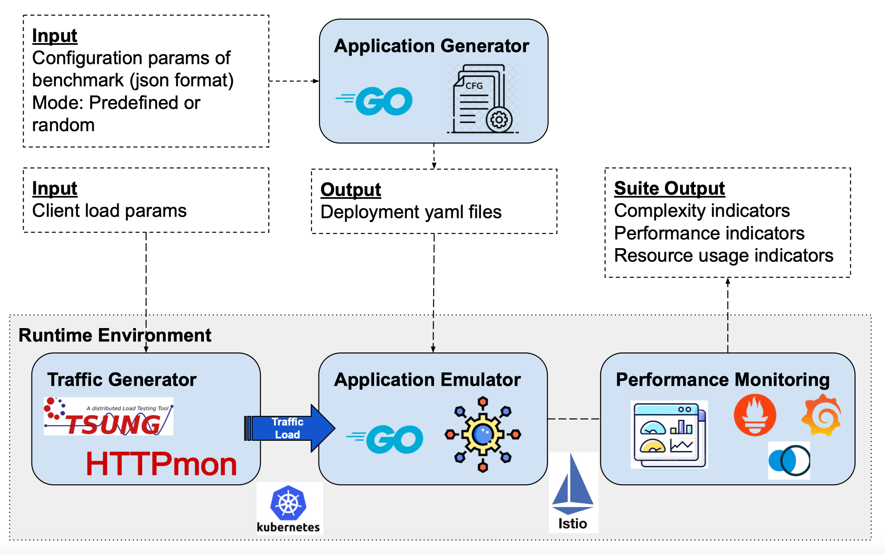

# Welcome to HydraGen's documentation!

HydraGen is an open-source tool that generates and emulates microservice-based benchmarks with different computational complexities and topologies in a systematic and reproducible way. It is intended to be used for evaluating performance at scale of web-serving applications, with major focus on inter-service communication properties. It enables thorough experimental evaluation of the implications of diverse application properties on the performance and scalability of cloud-native resource management mechanisms. HydraGen includes a set of tuning knobs that can be used to configure:

* The topology of the microservice-based application
* The computational complexity of each microservice
* The characteristics of the traffic between paired microservices
* Deployment characteristics related to microservice placement and scalability

A guide for getting started with HydraGen can be found [here](quick-start.md).

## HydraGen's Architecture



## Application Generator

The application generation module, implemented in Golang, can be used to generate a microservice-based application with a specific topology and complexity. The tool supports two different modes, _preset_ and _random_.

### Preset Mode

In preset mode, the users can precisely describe the configuration parameters of the application they want to emulate as JSON format, and the generator outputs a set of Kubernetes manifests in YAML format.

Documentation for the configuration parameters can be found [here](generator-parameters.md).

### Random Mode

In random mode, the tool automatically generates an application with random acyclic topology and random complexity based on a smaller set of constraining parameters given by the user. In this random mode, the tool generates both the JSON description file and the set of YAML Kubernetes manifests. This mode enables the user to rapidly generate any architecture, for instance, the user can generate architectures with hundreds of services by specifying the number of desired tiers or services.

## Application Emulator

The application emulator emulates the execution of all the microservices that are part of the application. It is implemented in Python and can run as either an HTTP server or a gRPC server. It also implements the supported resource stressors (i.e., CPU and network).

## Traffic Generator

The traffic generation tool allows generation of traffic load from an external client with customizable traffic patterns using different communication protocols. Our tool can be used with any traffic load generator tool such as [HTTPmon](https://github.com/cloud-control/httpmon) or [Tsung](http://tsung.erlang-projects.org). The traffic can be customized based on parameters such as the number of concurrent requests, think-time, and duration.

## Performance Monitoring

This module is used to monitor traffic performance and resource usage metrics. It is based on a metric collection, storage, and visualization pipeline that relies on Kubernetes, Istio, Prometheus, Grafana and Kiali. It also includes tools for statistical analysis of experimental results.

Prometheus stack is used to collect resource utilization metrics. Furthermore, we use the monitoring capabilities of Istio sidecar proxies together with Prometheus to collect traffic performance metrics.

### Grafana Configuration

```bash
kubectl create configmap grafana-config \
    --from-file=grafana-dashboard-provider.yaml=grafana-dashboard-provider.yaml
```

```bash
kubectl create secret generic grafana-creds \
  --from-literal=GF_SECURITY_ADMIN_USER=admin \
  --from-literal=GF_SECURITY_ADMIN_PASSWORD=graphsRcool
```
