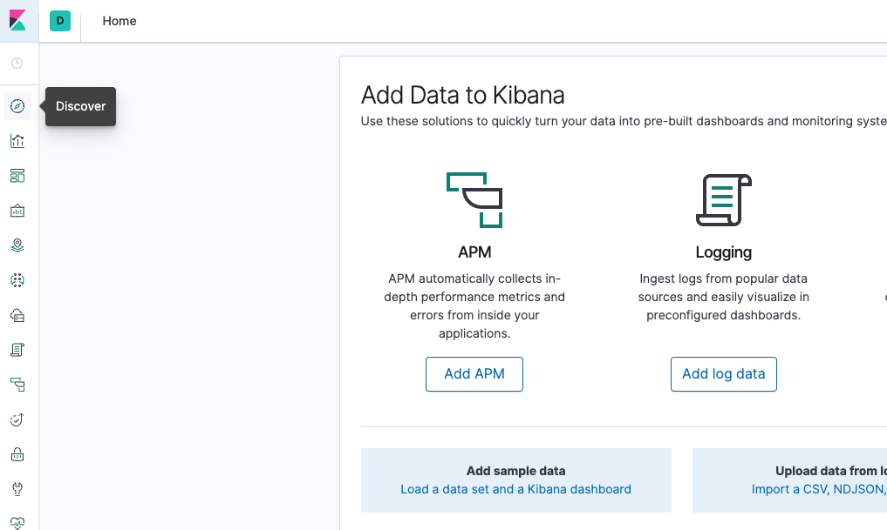
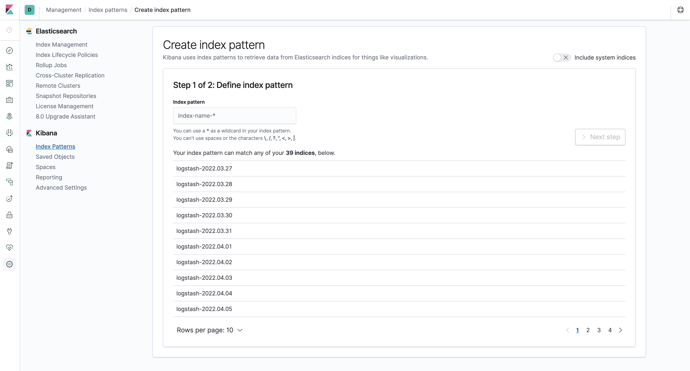
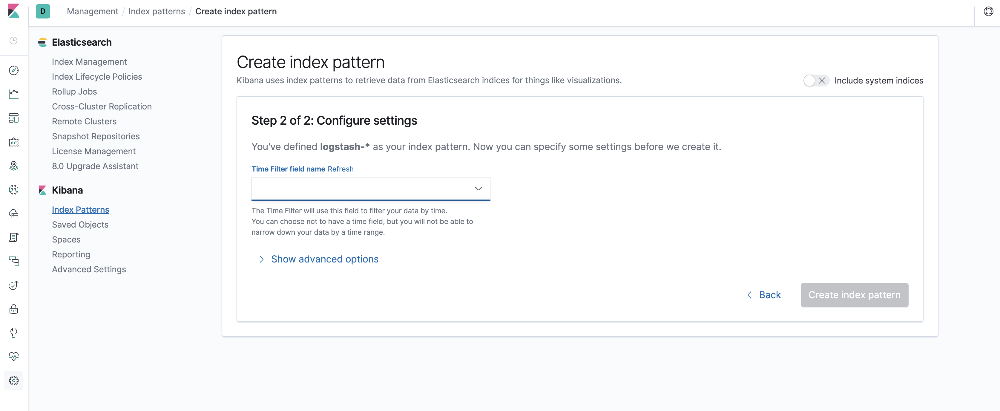
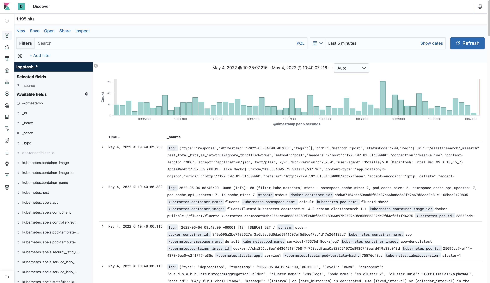
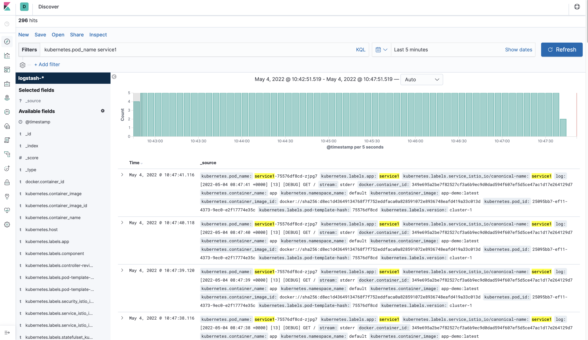

# Logging using Elasticsearch

One of the major issues in distributed environments is the ability to collect logs. In this tool we tried to collect everything in an optimized way using Elasticsearch with just one minor configuration in the input file!
In this way, the `logging` parameter will be true in `configmap` in all microservices.

To be able to see logging, you need to simply add the following in the input file:

```json
{
    ...
    "settings": {
        "logging": true
    },
    ...
}
```

Then generate the configuration files:

```bash
cd generator
./generator.sh preset input/new-description.json
```

And finally run the `deploy.sh` script to deploy the Elasticsearch and microservices.

```bash
cd generator
./deploy.sh input/new-description.json
```

Running the above command might take a while (if logging is required). When the execution is finished, something like the following will be printed:

```text
kubectl apply -f elk/
Deploying Elasticsearch stack with 3 nodes ...
It might take a while ... (up to 5 minutes, enjoy your coffee! :D)
$(kubectl apply -f ./elk/)
Waiting for Elasticsearch stack to be ready...
Waiting for Elasticsearch stack to be ready...
Waiting for Elasticsearch stack to be ready...
Waiting for Elasticsearch stack to be ready...
Waiting for Elasticsearch stack to be ready...
Waiting for Elasticsearch stack to be ready...
Kibana is deployed in node-1
To browse kibana, just copy the following address or replace the public ip of the node with the <node-ip>:
    http://<node-ip>:30000
    or
    http://192.168.1.2:30000
applying deployment manifests to cluster-1
```

Simply copy the address to the browser and enjoy using Elasticsearch. (It might take around 30 seconds for Kibana to be ready!)

## Multicluster Environment Configuration

If you are running in a multicluster environment, you need to install `fluentd` on all clusters. To do so, you need to pass the public address of master node in which elasticsearch is deployed.

```bash
cd elk/
./fluentd_installation.sh <master-ip-address>
```

## Working with Elasticsearch

After executing the above steps successfully, now It is time to work with Kibana. Browse the address mentioned previously. Click on Discover in the left-hand navigation menu:



You should see the following configuration window:



This allows you to define the Elasticsearch indices you’d like to explore in Kibana. Now, let's just use the `logstash-*` wildcard pattern to capture all the log data. Enter `logstash-*` in the text box and click on Next step.

You’ll then be brought to the following page:



This allows you to configure which field Kibana will use to filter log data by time. In the dropdown, select the `@timestamp` field, and hit Create index pattern.
Now, hit Discover in the left hand navigation menu.

You should see a histogram graph and some recent log entries:



To be able to explore the latest logs for a given pod, we should deploy them and make sure that they are created and running.

Let's assume that our pod name is `service1-75576df8cd-zjpg7`, then from the **Discover** page, in the search bar enter `kubernetes.pod_name:service1`. This filters the log data for Pods named `service1`.
You should then see a list of log entries for the `service1` Pod:


